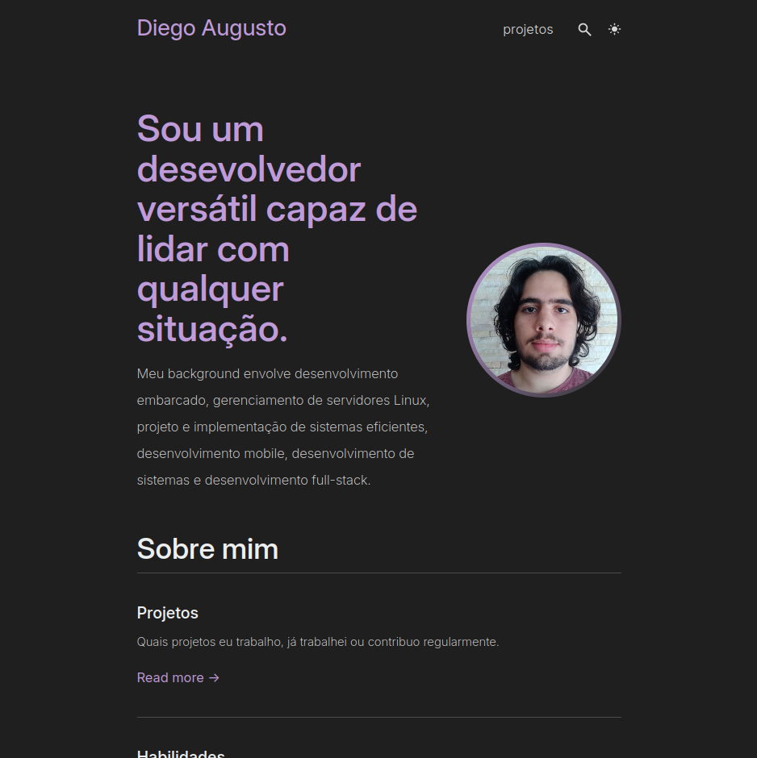

# My Portfolio
This repository contains a website written in Markdown with [Zola] and Tabi what showcases my habilitites and stuff I have worked on.

This project is built and hosted on https://diegovsky.me

## Running
To run, you must have [Zola] installed. Then, you can simply execute `zola serve` in your terminal. After that, you should click the link that appears in your terminal.

[Zola]: https://www.getzola.org/
