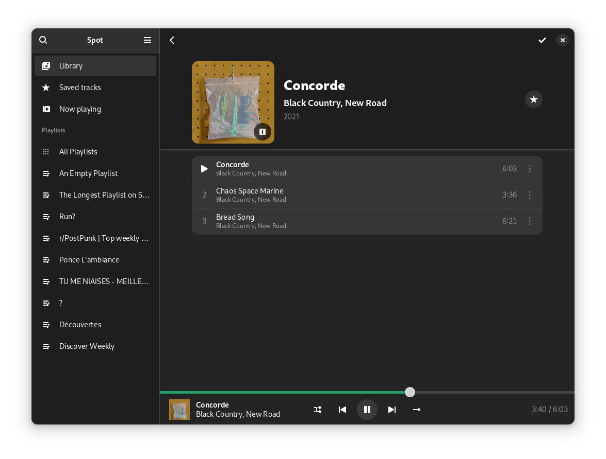

+++
title = "Projetos"
description = "Quais projetos eu trabalho, já trabalhei ou contribuo regularmente."
+++
Sou uma pessoa que ama desenvolver software, seja para melhorar software existente ou criar algo completamente novo. Por causa disso, acabo realizando vários projetos diferentes, sendo eles profissionais ou não. 
# Spot
Apesar do meu trabalho profissional, desenvolvo vários projetos no meu tempo livre. Meu projeto mais ambicioso atualmente é o Spot, um frontend nativo do Spotify para Linux

# ODE Designer

Atualmente, também realizo pesquisa na UFSJ, desenvolvendo o software ODE Designer, uma ferramenta de visão computacional que facilita a construção, visualização e simulação de equações diferenciais ordinárias.

